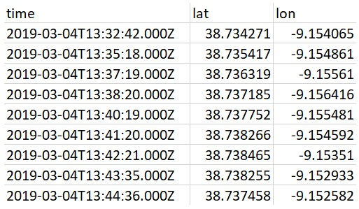
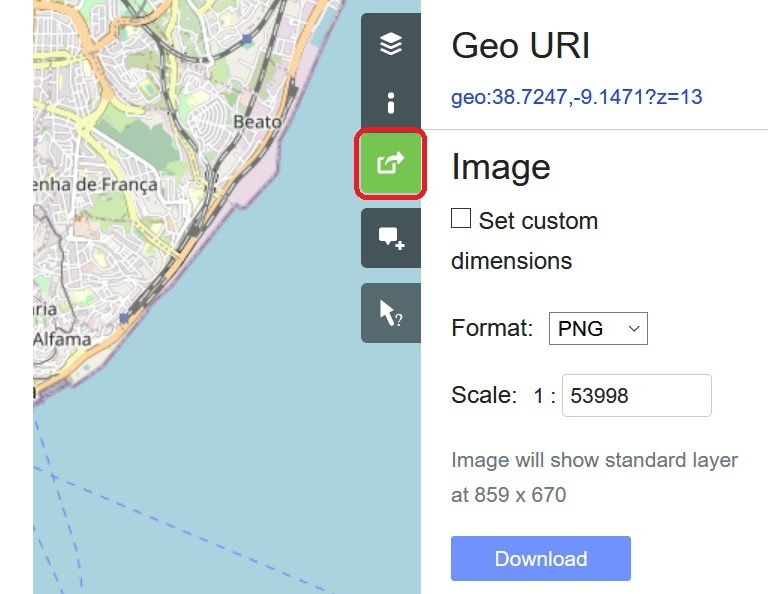
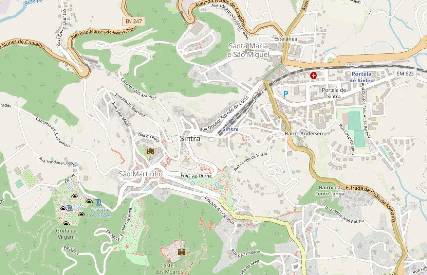

# Explore new city

This is a [Python](https://www.python.org/) script that can convert your location history logs, exported from location tracking apps, into various visualizations, for example, the one that shows you how you were 'uncovering' neighbourhoods of a new city.

This is me exploring Lisbon, Portugal, for 4 days in March 2019 🙂:

## Input / output

`Input`: CSV files with location history (latitude and longitude coordinates) 
`Output`: A set of images that can be combined together to create a gif

You can track your location history with many apps, e.g. _Google Maps_ (Android, iOS) or _GPSLogger_ (Android). Many of them offer a selection of export formats, but if CSV is not one of them, it can be still obtained by converting from KML or GPX.

## Requirements

- Python version 3.3+ to be able to run Python code ([download here](https://www.python.org/downloads/))
- [Jupyter Notebook](https://jupyter.org/) to be able to read and modify Python code in a nice interface ([installation guideline here](https://jupyter.readthedocs.io/en/latest/install/notebook-classic.html))
- A tool for converting images into gifs, e.g. [ScreenToGif](https://www.screentogif.com/)

## How to run it

1. Add your CSV files to the `csv` folder

2. Before running the script, open the
 Command Prompt and navigate to the folder with the `requirements.txt` file

3. Run `pip install -r requirements.txt` to install the necessary Python modules

4. The script itself is organized into different sections (e.g. "importing CSV files", "defining plot properties", etc.) inside a [Jupyter Notebook](https://jupyter.org/) file

5. To run the script just click `Run` for every code snippet, keeping the sequence

6. At some point you will need to add an image of a map to the `maps` folder that will be used in your visualization 
You can create one by using the share feature on [Open Street Map Export page](https://www.openstreetmap.org/export#map)

7. When you finish running the script, all plots will be exported to the `output` folder.

## Other visualizations

_The code snippets to create these visualizations are also included in the main script._

Trace

Heatmap

🙂

## License

[MIT](https://choosealicense.com/licenses/mit/)
